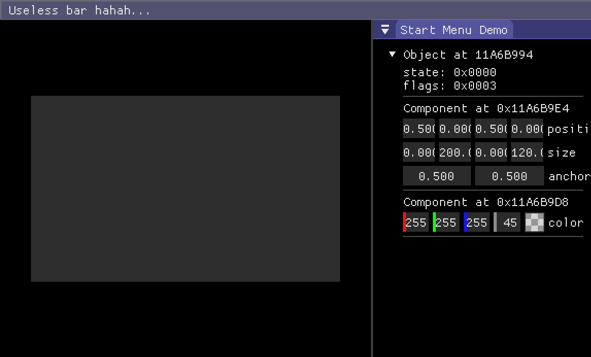

# Dear ImGui in the Story Royale Engine
Heyo!! This is the official repository for the Story Royale Engine's ImGui backend implementation. It is still unsure if I myself am going to use this for the entire course of the game's development (I would only use it for runtime property adjustments that would otherwise take lots of time to do), but, if you now want to integrate ImGui using this engine, you'll be able to now natively, without having to rely on the official ImGui backends (nor d3dcompiler.lib...).

## Limitations
Just note that, since this engine is somewhat limited, so not all of the (optional) features are available.

The unavailable features include: *Support for **clipboard**, **gamepad**, different **mouse cursors**, setting the **mouse position**, and **multi viewports** for the docking branch (however, docking spaces are totally supported)*

I haven't gotten into practically all of the features, but for most of them, I'm still looking into implementing them, basically all of them.

## Why?

Using the already working and stable backends is possible, at the end of the day, this game engine uses SDL2, and every available rendering backend that this engine uses is also there, but, I have used them already... And that is the problem, there're lots of workarounds that I had to do to support ImGui on this, one of them being that to support rendering you have to implement the ImGui rendering code in EVERY SINGLE backend. And it was there, it's part of the digital footprint left in the engine's commit history (you can look at it), and it was EXTREMELY unreliable, also causing another problem in which we will get to...

So, why not only make the rendering backend, And use SDL for the platform backend?...

There's yet other problems: Most of the SRE's loops and callbacks run on a separate thread while the main thread only handles the application's events, this caused only one problem and it was that SDL's implementation of ImGui called functions that were not safe at all to call outside the main thread... Also considering that I was getting weird "io.DisplaySize >= 0" assertion failures.

This demotivated me a lot to use ImGui, and since it was a niche thing to use I wanted to use it... And another big problem was that, ImGui was a dependency for the engine, SRE depended on ImGui. And this is really bad, you don't want to release a game with ImGui bundled on it, and even if you didn't link ImGui, you still had it as a dependency in your project, even if you didn't want to use it... (That's also the other reason why calling each implementation for each rendering backend was extremely unreliable)

Also, ImGui had to be implemented in the core engine, and I did not want that, it's up to the user to implement this and that's what this repository is for, I additionaly don't want the user, aka the game developer to be forced to rely on SDL and call some ImGui_Impl_SDL-type function, and even if you called this from something like this repository, and this repository just relied on SDL, it'd practically be the same. This is a library and it doesn't rely on the core engine's internals.

Another cool thing is that it forced me to add more features to the engine, necessary for ImGui to work properly or better (like for now, text input...)

This project implements both ImGui's platform and render backends, in a way that it should be safe to call in their respective function (we'll talk about that in the next section). Additionally, there are a few datatype helpers available (right now for sre::vec2 and sre::udim & sre::udim2)



## Getting started

###### Assuming you have a working game using the engine:

In your project, include this repository

``` sh
git clone https://github.com/bbeltza/Story-Royale-Engine-ImGui.git <folder-name>
```

You need to also clone [**ImGui**](https://github.com/ocornut/imgui) in order to use this library, obviously. This repository doesn't include ImGui, so you'll need to tell it where ImGui is. In your `CMakeLists.txt`, include the repository:

``` cmake
# IMGUI_PATH is the variable that it'll be looked at.
# If you don't set this, then it'll look into a folder named "imgui" in the project's directory, and then in this library's folder.
# Otherwise, set this to where you've cloned imgui
set(IMGUI_PATH "<imgui-path...>")
add_subdirectory(Story-Royale-Engine-ImGui) # Nobody should keep this folder's name like this... Of course I'm kidding, but set this to the name you cloned this repository to
...
SRE_BUILD(mygame SOURCES ...) # Assume this is your `SRE_BUILD` call
# imgui_sre will automatically include imgui's source files,
# so you won't need to make an own project to include them
# However, it won't include `imgui_demo.cpp`, so if you're using demo functions like `ImGui::ShowWindowDemo`, then you must include that file manually.
target_link_libraries(mygame PRIVATE imgui_sre)
...
```

In your game's source code, include (Whenever you want to use imgui_sre):
``` c++
#include <sre/imgui.hpp> // This automatically includes "imgui.h" too
```

In your initialization function, add:
``` c++
... 
    ImGui::CreateContext();
    sre::imgui::init();
    
    /* Feel free to look around the various options in ImGuiIO, there are lots of things you can do and you're not force to exactly follow what's below shown: */
    ImGuiIO& io = ImGui::GetIO();
    io.ConfigFlags |= ImGuiConfigFlags_NavEnableKeyboard
                   |  ImGuiConfigFlags_DockingEnable; // If you're on the `docking` branch.
...
```

Then, connect a few callbacks to core events to update imgui:

``` c++
static void imgui_onevent(void* signal_data, void* conenction_data, sre::Event ev);
static void imgui_beforerender();
static void imgui_afterrender();
...
    sre::onEvent.connect(imgui_onevent, NULL);
    sre::beforeRender.connect(imgui_beforerender, NULL);
    sre::beforeRender.connect(imgui_afterrender, NULL);
...
```

In your `onEvent` callback, call `sre::imgui::on_event`, additionally, you can handle the sre::EVENT_QUIT event to shutdown imgui:

``` c++
static void imgui_onevent(void*, void*, sre::Event ev) {
    if (sre::imgui::on_event(ev))
        return; // sre::imgui::on_event returns `true` when it's handled an event, otherwise, false.
    ...

    if (ev.type() == sre::EVENT_QUIT) {
        sre::imgui::shutdown();
        ImGui::DestroyContext();
    }
}
```

In your render functions, call the `NewFrame` and `Render` functions:

``` c++
// It's not recommended to call ImGui functions inside other beforeRender/afterRender connections, since they can be called before or after ImGui's NewFrame and Render calls respectively... Call them inside the same functions where you call ImGui::NewFrame/Render, or call them from ECS/GUI `render` callbacks c:

static void imgui_beforerender() {
    sre::imgui::newframe();
    ImGui::NewFrame();
    ...
    // Uncomment this if you want the demo window :)
    // ImGui::ShowDemoWindow();
    ...
}

static void imgui_afterrender() {
    ...

    ImGui::Render();
    sre::imgui::renderdrawdata(ImGui::GetDrawData());
}

```

This should be it, if there's any mistakes done, please, tell me... I haven't ever tested this... But it should work

For the demo window, you should include `imgui_demo.cpp`, in your project:

``` cmake
...
# Using IMGUI_PATH to determine IMGUI's directory, it gets set automatically if you haven't set it.
# There are workarounds if you don't want to use `target_sources`, like adding a separate library including this source file... But we'll just use this
target_sources(mygame PUBLIC "${IMGUI_PATH}/imgui_demo.cpp")
...
```